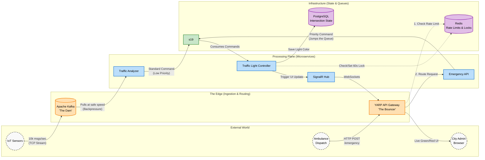

# Architecting a Fault-Tolerant, Event-Driven Smart City Traffic Grid

This repository contains the source code, infrastructure configuration, and documentation for a distributed, cloud-native Smart City Traffic Management System. The project demonstrates how polyglot messaging architectures (Kafka + RabbitMQ) can solve the "Thundering Herd" problem in IoT networks while guaranteeing zero-data-loss emergency routing.

## 🗺️ System Architecture

The system is designed with "Two Front Doors" to handle different types of network traffic safely:
1. **The Dam (Kafka):** Absorbs massive, continuous TCP streams of IoT sensor data without dropping messages.
2. **The Bouncer (YARP):** Protects the internal HTTP APIs using Redis-backed distributed rate limiting.

## 🔬 1. Research Methodology

This project employs an **Experimental and Quantitative Research Methodology** to evaluate the performance, resilience, and security of an Event-Driven Architecture (EDA) under extreme load. 

### 1.1. Research Approach
The study utilizes a comparative and stress-testing approach, specifically employing a **Dual-Vector Testing Strategy** to validate the architectural design:
*   **Backend Throughput Testing (The "Dam"):** Simulating high-frequency IoT sensor data (the "Thundering Herd") bypassing HTTP to directly hit Apache Kafka. This measures the system's ability to utilize backpressure and load-leveling without dropping critical city data.
*   **Edge Defense Testing (The "Bouncer"):** Simulating malicious DDoS attacks and spam requests against the HTTP API Gateway to validate the efficacy of distributed rate limiting.
*   **Chaos Engineering (Resilience Testing):** Intentionally terminating critical microservices during active message processing to verify temporal decoupling and zero-message-loss guarantees via RabbitMQ.

### 1.2. Data Collection & Metrics
Data will be collected using **OpenTelemetry** (integrated via .NET Aspire). The primary metrics for evaluation include:
*   **End-to-End Latency:** Time taken from sensor ingestion to state mutation.
*   **System Uptime & Resource Utilization:** CPU and memory consumption of the processing nodes during traffic spikes.
*   **API Rejection Rate:** Successful HTTP `429 Too Many Requests` responses during simulated API floods.

---

## 🛠️ 2. Tools and Approaches Used

The project bridges academic distributed systems theory with modern, industry-standard cloud-native tooling.

### 2.1. Architectural Approaches
*   **The "Two Front Doors" Pattern:** Separating ingestion methods based on actor type. IoT sensors utilize continuous TCP streams (Kafka) for high-throughput absorption, while external actors (Ambulances/Web UI) utilize an HTTP API Gateway for strict security and routing.
*   **Event-Driven Architecture (EDA) & Temporal Decoupling:** Ensuring the sender and receiver do not need to be online simultaneously, preventing cascading system failures.
*   **Distributed Rate Limiting:** Utilizing a centralized cache to enforce API throttling across a horizontally scaled microservice cluster, preventing "limit leakage" behind load balancers.
*   **Distributed State Locking:** Preventing database race conditions during emergency overrides using high-speed, TTL-based caching.

### 2.2. Technology Stack
*   **Core Framework:** `.NET 9` (C#)
*   **Orchestration & Observability:** `.NET Aspire` (Local container management, service discovery, and OpenTelemetry dashboards).
*   **Edge Routing / API Gateway:** `YARP` (Yet Another Reverse Proxy) to secure internal microservices and route HTTP/WebSocket traffic.
*   **High-Throughput Ingestion:** `Apache Kafka` (Acts as a shock-absorber for massive streams of IoT sensor data).
*   **Command & Control Routing:** `RabbitMQ` with `MassTransit` (Handles reliable, priority-based command execution).
*   **High-Speed Distributed State:** `Redis` (Manages 60-second TTL intersection locks and centralized API Rate Limiting).
*   **Persistent Storage:** `PostgreSQL` with `Entity Framework Core` (Stores permanent intersection configurations and history).
*   **Real-Time Visualization:** `SignalR` (WebSockets for pushing live traffic light state changes to a web dashboard).
*   **Containerization:** `Docker` (Hosts all infrastructure dependencies).

---

## 📅 3. Detailed Project Plan

The project is executed over a 14-week academic semester, divided into five major milestones.

### Phase 1: Infrastructure & Skeleton (Weeks 1-2)
*   **Objective:** Establish the cloud-native foundation.
*   **Tasks:** Initialize .NET Aspire AppHost. Configure Docker containers for Kafka, RabbitMQ, PostgreSQL, and Redis. Verify OpenTelemetry dashboard connectivity.
*   **Deliverable:** Running infrastructure with zero business logic.

### Phase 2: Telemetry Pipeline (Weeks 3-5)
*   **Objective:** Implement the "Observation Plane" (High-Throughput).
*   **Tasks:** Develop the `SensorSimulator` worker service to generate dummy IoT data. Implement Kafka producers. Develop the `TrafficAnalyzer` to consume the Kafka stream using backpressure.
*   **Deliverable:** System successfully ingests and logs 1,000+ sensor messages per second without memory overflow.

### Phase 3: Command Routing & State (Weeks 6-8)
*   **Objective:** Implement the "Action Plane" (High-Reliability).
*   **Tasks:** Define shared message contracts. Configure MassTransit for RabbitMQ. Develop the `TrafficLightController` to consume commands and mutate PostgreSQL state.
*   **Deliverable:** `TrafficAnalyzer` successfully triggers database updates via RabbitMQ.

### Phase 4: Edge Routing & Emergency Override (Weeks 9-11)
*   **Objective:** Implement the API Gateway, priority routing, and visualization.
*   **Tasks:** Deploy YARP as the API Gateway. Develop the `EmergencyAPI`. Implement Redis for both Distributed Rate Limiting (in YARP) and TTL intersection locks. Build a basic SignalR hub to broadcast state changes.
*   **Deliverable:** Emergency commands bypass standard queues, lock the intersection via Redis, and update the SignalR dashboard in real-time.

### Phase 5: Testing, Metrics, & Documentation (Weeks 12-14)
*   **Objective:** Validate the research methodology and finalize the thesis.
*   **Tasks:** Conduct Dual-Vector load tests (Kafka throughput vs. YARP rate limiting). Perform container crash simulations. Export OpenTelemetry graphs. Write the final academic paper.
*   **Deliverable:** Final thesis submission and project defense presentation.

---

---
